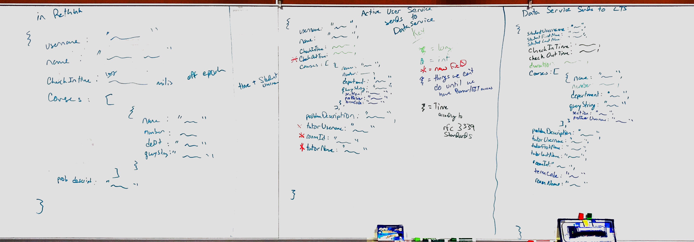

# Data Model



```
Every **session** should have the following attributes: [^1]

- _Student id_
- _Start time_
- _End time_
- duration
- Course
    - department
    - number
- Section number/professor id? - some way of identifying professor
- tutor id

[^1]: Italics indicates _candidate primary key_
```